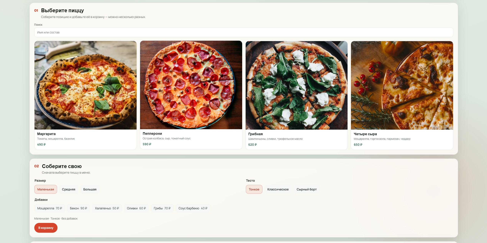
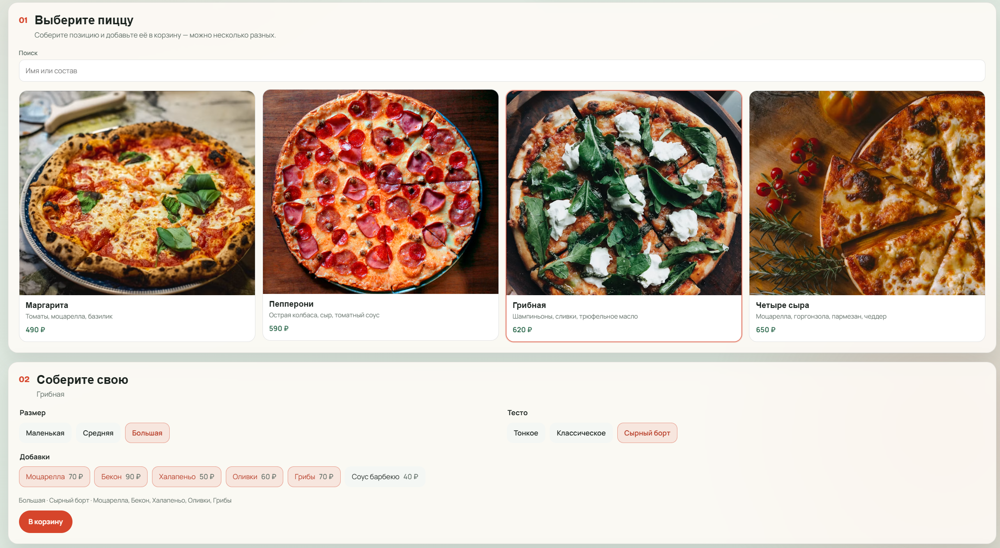
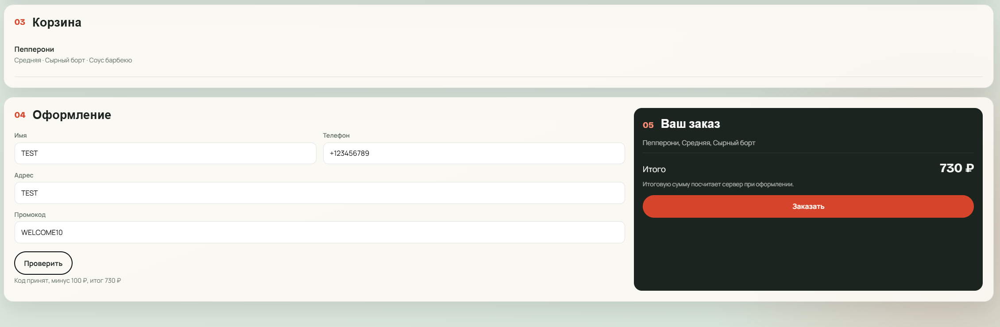
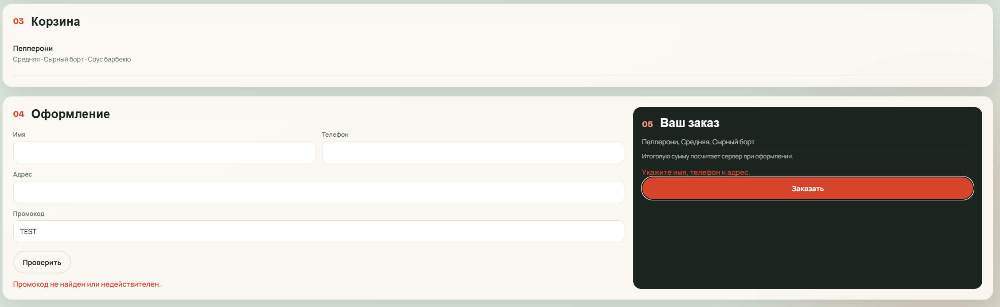
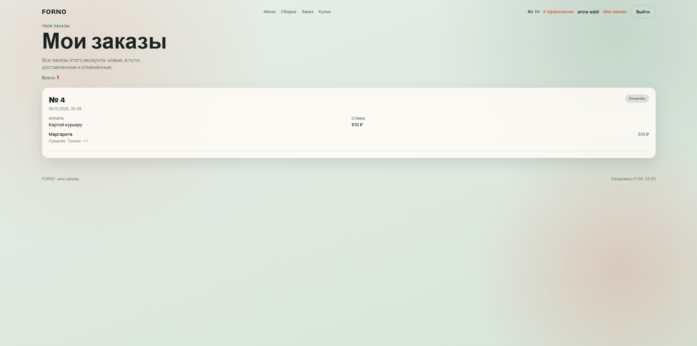
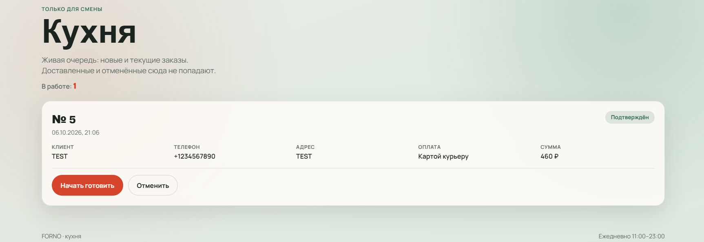

# FORNO

A pizza shop for a portfolio: an ASP.NET Core MVC site, a React menu on the home page, and SQL Server LocalDB behind Entity Framework Core.

A guest can build a pizza and place an order. A signed-in customer sees only their own orders, and the status on that page updates live. The kitchen moves an order along: confirmed, cooking, on the way, delivered, or canceled. Prices, the promo discount, and the stored address are calculated on the server. The browser does not decide the total.

## What the site does

- Menu of pizzas with a photo, ingredients, and base price. Search matches the name or the ingredients.
- Each line has its own size, dough, toppings, and quantity. Several different pizzas can sit in one order.
- Checkout asks for a name, a phone number, and an address. Empty fields are rejected in the form and again on the server.
- Promo code `WELCOME10` subtracts 100 rubles from the order total. The discount is previewed before submit and applied again when the order is saved. The total never goes below zero.
- A signed-in customer can pick an address saved from an earlier order. A new address is remembered after a successful order. A guest can still order; nothing is saved for them.
- **My orders** lists only the current user. The status badge updates through SignalR when the kitchen or the background job changes it.
- An order that stays **New** for 20 minutes is canceled automatically. Cooking and later statuses are left alone.
- The kitchen screen is available only to the kitchen role. Each status can move only to the next allowed one.
- Russian and English cover the header, the home page, sign-in, registration, my orders, the success page, and the kitchen. Pizza and topping names stay as they are stored in the database.

## Screenshots

| | |
| --- | --- |
| Home and the menu |  |
| Size, dough, and toppings |  |
| Cart, checkout, and an accepted promo code |  |
| Required name, phone, and address |  |
| My orders |  |
| Kitchen board |  |

## Prerequisites

- Windows with [SQL Server LocalDB](https://learn.microsoft.com/sql/database-engine/configure-windows/sql-server-express-localdb) (`MSSQLLocalDB`).
- [.NET 8 SDK](https://dotnet.microsoft.com/download/dotnet/8.0).
- Node.js 20 or newer, only if you change the React menu. The built bundle is already in `FornoPizza/wwwroot/menu`.
- `dotnet-ef` 8, for applying migrations:

```
dotnet tool install --global dotnet-ef --version 8.0.29
```

## Database

The catalog name is `FornoPizza`. The connection string is `ConnectionStrings:DefaultDbConnection` in `FornoPizza/appsettings.json`:

```
Data Source=(localdb)\MSSQLLocalDB;Initial Catalog=FornoPizza;Integrated Security=True;Connect Timeout=30;
```

The site does not apply migrations on startup. From the repository root:

```
dotnet ef database update --project FornoPizza.Data --startup-project FornoPizza.Data
```

Stop the site before that command. A running process locks `FornoPizza.Data.dll`.

Migrations also seed the menu and the promo code `WELCOME10`.

## Run

From `FornoPizza`:

```
dotnet run --launch-profile http
```

Open http://localhost:5297. The `http` profile sets `ASPNETCORE_ENVIRONMENT` to Development. That profile is what makes the kitchen shortcut below available.

## Rebuild the menu

The home page loads `FornoPizza/wwwroot/menu/menu.js`. After a change under `FornoPizza/client`, rebuild from that folder:

```
npm install
npm run build
```

On PowerShell, if `npm` is blocked by the execution policy, call `npm.cmd` instead. Then refresh http://localhost:5297. The C# site does not need a restart for a new script file.

`npm run dev` starts a Vite workshop on port 5173. It is not the pizzeria.

## Kitchen

With the site running in Development, open:

http://localhost:5297/Account/CreateKitchen

The kitchen login and password are not in the source. From the repository root, set them once in user secrets:

```
dotnet user-secrets set "Kitchen:Name" "your-kitchen-login" --project FornoPizza
dotnet user-secrets set "Kitchen:Password" "your-kitchen-password" --project FornoPizza
```

The action creates the kitchen user when it does not exist yet, signs that user in, and opens the kitchen board. Outside Development the same address returns 404. There is no link to it in the header.

## Tests

From the repository root:

```
dotnet test
```

Tests use the EF Core in-memory provider. LocalDB is not required.

## Layout

| Project | Role |
| --- | --- |
| `FornoPizza` | ASP.NET Core site: Razor pages, Minimal API for the React menu, auth, kitchen, SignalR |
| `FornoPizza.Data` | Entities, EF Core context, migrations, repositories |
| `FornoPizza.Tests` | Price, status transitions, and “my orders” |
| `FornoPizza/client` | React menu, built into `wwwroot/menu` |
